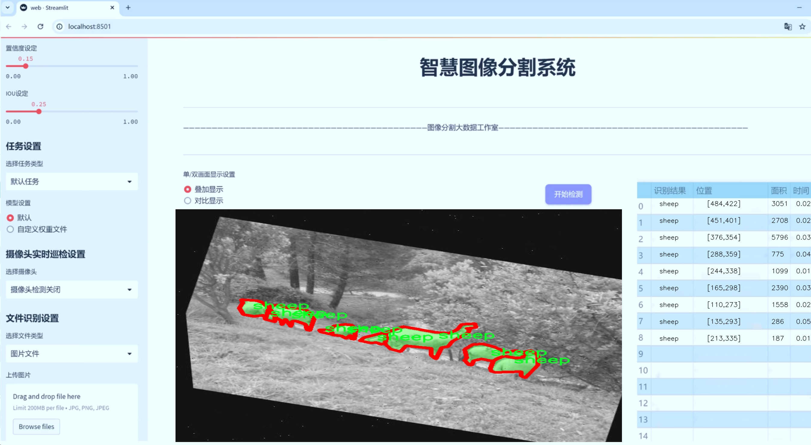
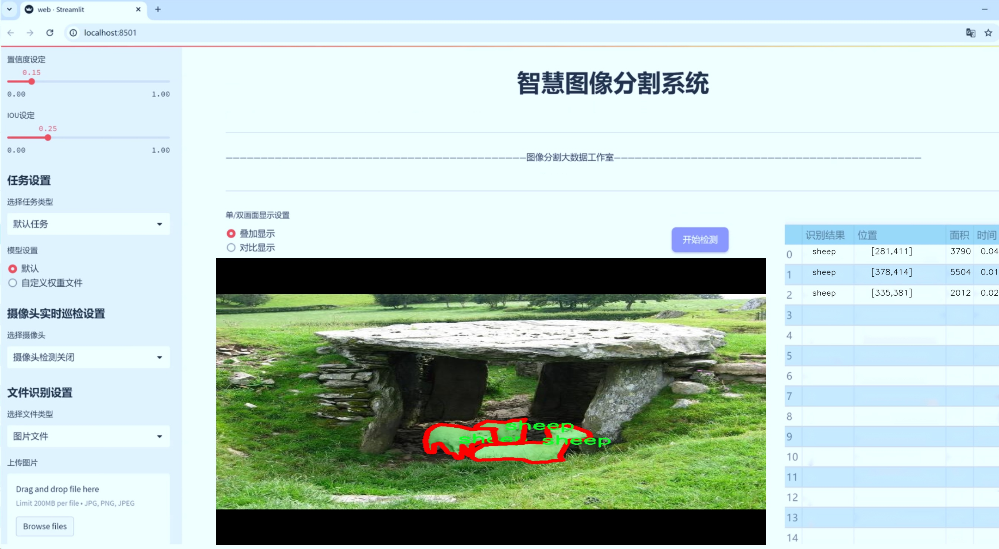
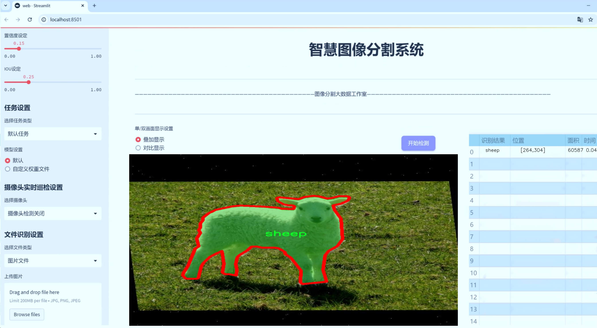
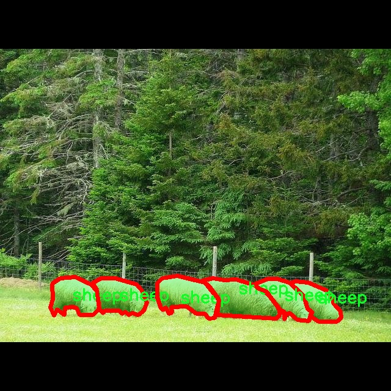
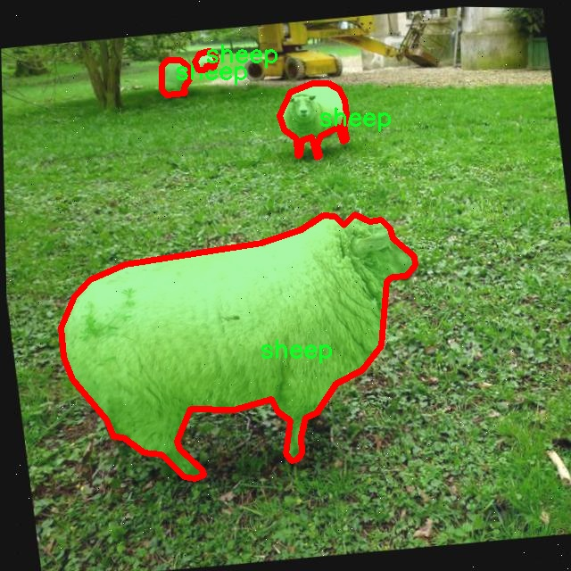
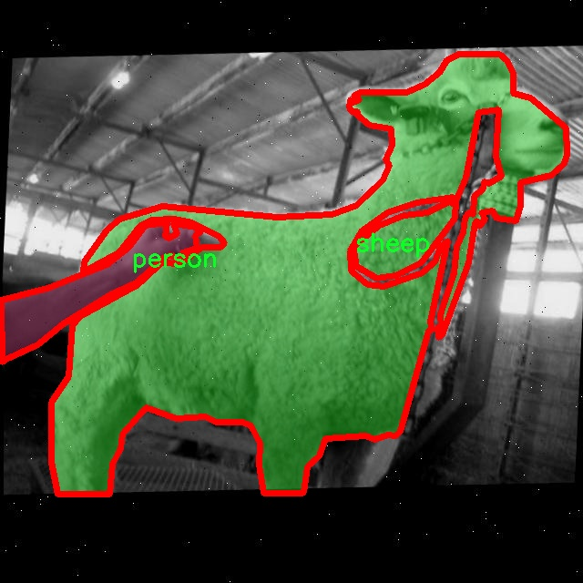
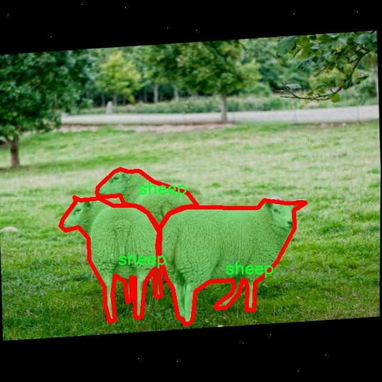
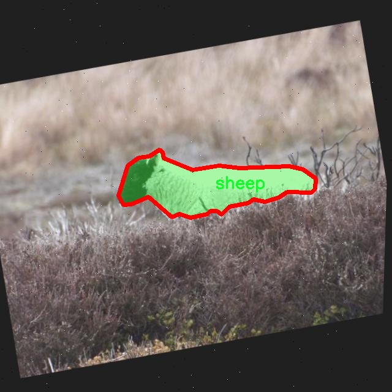

# 动物图像分割系统： yolov8-seg-C2f-DySnakeConv

### 1.研究背景与意义

[参考博客](https://gitee.com/YOLOv8_YOLOv11_Segmentation_Studio/projects)

[博客来源](https://kdocs.cn/l/cszuIiCKVNis)

研究背景与意义

随着计算机视觉技术的迅猛发展，图像分割作为其重要分支之一，逐渐在多个领域中展现出广泛的应用潜力。尤其是在动物图像处理领域，准确的图像分割不仅能够提高动物识别的准确性，还能为动物行为分析、生态监测以及动物保护等提供有力支持。近年来，YOLO（You Only Look Once）系列模型因其高效的实时检测能力而受到广泛关注。YOLOv8作为该系列的最新版本，结合了深度学习和计算机视觉的前沿技术，展现出优越的性能。然而，针对特定应用场景，尤其是动物图像分割，现有的YOLOv8模型仍存在一定的局限性。因此，基于改进YOLOv8的动物图像分割系统的研究显得尤为重要。

本研究的主要目标是构建一个基于改进YOLOv8的动物图像分割系统，利用特定的数据集进行训练和测试。该数据集包含1200张图像，涵盖了狗、羊、山羊、行人和其他物体五个类别。这一多样化的类别设置为模型的训练提供了丰富的样本，能够有效提升模型在不同场景下的适应能力。通过对这些图像进行实例分割，不仅可以实现对动物个体的精确识别，还能对其在环境中的位置和行为进行深入分析。

在生态保护和动物研究领域，准确的动物图像分割系统能够帮助研究人员更好地监测野生动物的种群动态和栖息地变化。例如，通过对动物图像的分割分析，研究人员可以获取有关动物活动模式、社交行为及其与环境相互作用的重要信息。此外，在农业和畜牧业中，精确的动物识别和行为分析能够帮助农民优化养殖管理，提高生产效率，降低资源浪费。

本研究的意义不仅在于技术上的创新，更在于其对实际应用的推动。通过改进YOLOv8模型，使其更适合于动物图像分割任务，可以为相关领域提供一种高效、准确的解决方案。同时，研究成果也将为后续的深度学习研究提供新的思路和方法，推动计算机视觉技术在动物保护、生态监测等领域的应用发展。

综上所述，基于改进YOLOv8的动物图像分割系统的研究，不仅具有重要的学术价值，也具有显著的社会意义。通过该系统的构建与应用，期望能够为动物保护和生态研究提供强有力的技术支持，推动相关领域的可持续发展。

### 2.图片演示







注意：本项目提供完整的训练源码数据集和训练教程,由于此博客编辑较早,暂不提供权重文件（best.pt）,需要按照6.训练教程进行训练后实现上图效果。

### 3.视频演示

[3.1 视频演示](https://www.bilibili.com/video/BV1ZtSFYtE2n/)

### 4.数据集信息

##### 4.1 数据集类别数＆类别名

nc: 4
names: ['dog', 'goat', 'person', 'sheep']


##### 4.2 数据集信息简介

数据集信息展示

在本研究中，我们采用了名为“zxc”的数据集，以训练和改进YOLOv8-seg模型，旨在提升动物图像分割系统的性能。该数据集专注于四种特定类别的动物及其与人类的交互场景，类别包括：狗、山羊、人物和绵羊。这四个类别的选择不仅涵盖了常见的家畜和伴侣动物，还涉及了人类在自然环境中与这些动物的互动，为模型的训练提供了丰富的上下文信息。

“zxc”数据集的构建考虑到了多样性和代表性，确保每个类别都包含了足够的样本量，以便模型能够学习到各类动物的特征和分割边界。数据集中包含的图像来源于不同的环境和场景，涵盖了城市、公园、农场等多种背景，确保了模型在各种条件下的适应性和鲁棒性。每个类别的图像均经过精细标注，确保了分割任务的准确性和有效性。通过使用高质量的标注工具，数据集中的每个实例都得到了准确的边界框和分割掩码，这对于训练YOLOv8-seg模型至关重要。

在数据集的设计过程中，我们特别关注了图像的多样性和复杂性。例如，狗的图像可能包括不同品种、颜色和体型的狗，山羊则可能在不同的环境中被拍摄，如山区、农场或草地。人物类别的图像则涵盖了不同性别、年龄和服装风格的人，确保模型能够识别出各种人类形态与姿态。绵羊的图像同样展现了不同的生活场景，从广阔的草原到农场的围栏，这些都为模型提供了丰富的训练数据。

为了进一步增强数据集的实用性，我们还对图像进行了数据增强处理，包括旋转、缩放、裁剪和颜色调整等。这些增强技术不仅提高了模型的泛化能力，还使得模型能够更好地适应现实世界中可能遇到的各种变换和干扰。此外，数据集还包含了一些具有挑战性的场景，例如动物与人类的互动、动物在运动中的姿态变化等，这些都为模型的分割能力提出了更高的要求。

通过使用“zxc”数据集，我们期望能够显著提升YOLOv8-seg模型在动物图像分割任务中的表现。该数据集不仅为模型提供了丰富的训练素材，还通过多样化的场景和复杂的交互关系，帮助模型学习到更为细致和准确的分割特征。最终，我们希望通过这一研究，不仅能够推动动物图像分割技术的发展，还能为相关领域的应用提供更为可靠的技术支持。











### 5.项目依赖环境部署教程（零基础手把手教学）

[5.1 环境部署教程链接（零基础手把手教学）](https://www.bilibili.com/video/BV1jG4Ve4E9t/?vd_source=bc9aec86d164b67a7004b996143742dc)


[5.2 安装Python虚拟环境创建和依赖库安装视频教程链接（零基础手把手教学）](https://www.bilibili.com/video/BV1nA4VeYEze/?vd_source=bc9aec86d164b67a7004b996143742dc)

### 6.手把手YOLOV8-seg训练视频教程（零基础手把手教学）

[6.1 手把手YOLOV8-seg训练视频教程（零基础小白有手就能学会）](https://www.bilibili.com/video/BV1cA4VeYETe/?vd_source=bc9aec86d164b67a7004b996143742dc)


按照上面的训练视频教程链接加载项目提供的数据集，运行train.py即可开始训练



     Epoch   gpu_mem       box       obj       cls    labels  img_size
     1/200     0G   0.01576   0.01955  0.007536        22      1280: 100%|██████████| 849/849 [14:42<00:00,  1.04s/it]
               Class     Images     Labels          P          R     mAP@.5 mAP@.5:.95: 100%|██████████| 213/213 [01:14<00:00,  2.87it/s]
                 all       3395      17314      0.994      0.957      0.0957      0.0843

     Epoch   gpu_mem       box       obj       cls    labels  img_size
     2/200     0G   0.01578   0.01923  0.007006        22      1280: 100%|██████████| 849/849 [14:44<00:00,  1.04s/it]
               Class     Images     Labels          P          R     mAP@.5 mAP@.5:.95: 100%|██████████| 213/213 [01:12<00:00,  2.95it/s]
                 all       3395      17314      0.996      0.956      0.0957      0.0845

     Epoch   gpu_mem       box       obj       cls    labels  img_size
     3/200     0G   0.01561    0.0191  0.006895        27      1280: 100%|██████████| 849/849 [10:56<00:00,  1.29it/s]
               Class     Images     Labels          P          R     mAP@.5 mAP@.5:.95: 100%|███████   | 187/213 [00:52<00:00,  4.04it/s]
                 all       3395      17314      0.996      0.957      0.0957      0.0845


### 7.50+种全套YOLOV8-seg创新点加载调参实验视频教程（一键加载写好的改进模型的配置文件）

[7.1 50+种全套YOLOV8-seg创新点加载调参实验视频教程（一键加载写好的改进模型的配置文件）](https://www.bilibili.com/video/BV1Hw4VePEXv/?vd_source=bc9aec86d164b67a7004b996143742dc)

### YOLOV8-seg算法简介

原始YOLOv8-seg算法原理

YOLOv8-seg算法是2023年1月推出的YOLO系列最新版本，标志着计算机视觉领域在目标检测和实例分割任务中的一次重大突破。作为YOLO系列的继承者，YOLOv8不仅在精度和执行速度上超越了前代模型，还通过引入一系列创新技术，进一步提升了模型的整体性能。YOLOv8-seg的设计理念源于对YOLOv5、YOLOv6和YOLOX等模型的深入分析，综合了它们的优点，以实现更高效的目标检测和分割。

在YOLOv8-seg的架构中，核心组件包括输入层、Backbone骨干网络、Neck特征融合网络和Head检测模块。输入层负责对输入图像进行预处理，包括调整图像比例、执行Mosaic增强和计算瞄点，以确保模型能够在多样化的输入条件下保持稳定的性能。Backbone部分则采用了经过优化的CSP（跨阶段局部网络）结构，使用C2f模块替代了YOLOv5中的C3模块。这一变化使得特征提取过程更加高效，能够更好地捕捉到图像中的细节信息，同时保持了轻量级特性，适合在资源受限的环境中运行。

YOLOv8-seg的特征融合部分依然采用了双塔结构，结合了特征金字塔网络（FPN）和路径聚合网络（PAN），这使得模型能够有效地整合来自不同层次的特征信息，增强了对不同尺度目标的检测能力。通过这种方式，YOLOv8-seg能够在处理复杂场景时，充分利用上下文信息，从而提高分割精度。

在检测模块中，YOLOv8-seg引入了全新的Anchor-Free检测头，摒弃了传统的Anchor-Based方法。这一创新不仅简化了模型的结构，还加速了模型的收敛过程。解耦头结构的采用，使得分类和回归分支能够独立优化，从而提高了检测的准确性和效率。此外，YOLOv8-seg还使用了新的损失函数CloU，这一损失函数在训练过程中能够更好地引导模型学习，从而提升分割性能。

值得注意的是，YOLOv8-seg在小目标检测和高分辨率图像处理方面表现尤为突出。这得益于其在Backbone中对C2f模块的优化，使得模型能够更好地捕捉到小目标的特征信息。同时，SPPF模块的引入，通过不同内核尺寸的池化操作，对特征图进行有效合并，进一步提升了模型的计算速度和精度。

YOLOv8-seg的设计不仅关注模型的性能，还强调了工程化的简洁性和易用性。这使得研究人员和开发者能够更方便地在各种应用场景中部署该模型，从而推动了目标检测和实例分割技术的广泛应用。无论是在自动驾驶、安防监控，还是在医疗影像分析等领域，YOLOv8-seg都展现出了强大的适应能力和优越的性能。

综上所述，YOLOv8-seg算法通过对模型结构的全面优化和创新，提升了目标检测和实例分割的精度与速度。其独特的Backbone设计、特征融合策略和解耦检测头，使得YOLOv8-seg在处理复杂视觉任务时，能够有效地平衡性能与效率，为计算机视觉领域的进一步发展奠定了坚实的基础。随着YOLOv8-seg的不断应用和发展，未来在更广泛的场景中，我们有理由相信它将引领目标检测和实例分割技术的新潮流。


### 9.系统功能展示（检测对象为举例，实际内容以本项目数据集为准）

图9.1.系统支持检测结果表格显示

  图9.2.系统支持置信度和IOU阈值手动调节

  图9.3.系统支持自定义加载权重文件best.pt(需要你通过步骤5中训练获得)

  图9.4.系统支持摄像头实时识别

  图9.5.系统支持图片识别

  图9.6.系统支持视频识别

  图9.7.系统支持识别结果文件自动保存

  图9.8.系统支持Excel导出检测结果数据


### 10.50+种全套YOLOV8-seg创新点原理讲解（非科班也可以轻松写刊发刊，V11版本正在科研待更新）

#### 10.1 由于篇幅限制，每个创新点的具体原理讲解就不一一展开，具体见下列网址中的创新点对应子项目的技术原理博客网址【Blog】：


[10.1 50+种全套YOLOV8-seg创新点原理讲解链接](https://gitee.com/qunmasj/good)

#### 10.2 部分改进模块原理讲解(完整的改进原理见上图和技术博客链接)【如果此小节的图加载失败可以通过CSDN或者Github搜索该博客的标题访问原始博客，原始博客图片显示正常】
### 可变性卷积DCN简介
卷积神经网络由于其构建模块中固定的几何结构，本质上受限于模型几何变换。为了提高卷积神经网络的转换建模能力，《Deformable Convolutional Networks》作者提出了两个模块：可变形卷积（deformable convolution）和可变形RoI池（deformable RoI pooling）。这两个模块均基于用额外的偏移来增加模块中的空间采样位置以及从目标任务中学习偏移的思想，而不需要额外的监督。

第一次证明了在深度神经网络中学习密集空间变换（dense spatial transformation）对于复杂的视觉任务是有效的

视觉识别中的一个关键挑战是如何适应对象比例、姿态、视点和零件变形中的几何变化或模型几何变换。一般有两种方法实现：
1）建立具有足够期望变化的训练数据集。这通常通过增加现有的数据样本来实现，例如通过仿射变换。但是训练成本昂贵而且模型参数庞大。
2）使用变换不变（transformation-invariant）的特征和算法。比如比较有名的SIFT(尺度不变特征变换)便是这一类的代表算法。

但以上的方法有两个缺点：
1）几何变换被假定为固定的和已知的，这些先验知识被用来扩充数据，设计特征和算法。为此，这个假设阻止了对具有未知几何变换的新任务的推广，从而导致这些几何变换可能没有被正确建模。
2）对于不变特征和算法进行手动设计，对于过于复杂的变换可能是困难的或不可行的。

卷积神经网络本质上局限于模拟大型未知转换。局限性源于CNN模块的固定几何结构：卷积单元在固定位置对输入特征图进行采样；池化层以固定比率降低特征矩阵分辨率；RoI（感兴趣区域）池化层将RoI分成固定的空间箱（spatial bins）等。缺乏处理几何变换的内部机制。

这种内部机制的缺乏会导致一些问题，举个例子。同一个CNN层中所有激活单元的感受野大小是相同的，但是这是不可取的。因为不同的位置可能对应于具有不同尺度或变形的对象，所以尺度或感受野大小的自适应确定对于具有精细定位的视觉识别是渴望的。

对于这些问题，作者提出了两个模块提高CNNs对几何变换建模的能力。


deformable convolution（可变形卷积）
将2D偏移量添加到标准卷积中的常规网格采样位置，使得采样网格能够自由变形。通过额外的卷积层，从前面的特征映射中学习偏移。因此，变形采用局部、密集和自适应的方式取决于输入特征。


deformable RoI pooling（可变形RoI池化）
为先前RoI池化的常规库（bin）分区中的每个库位置（bin partition）增加了一个偏移量。类似地，偏移是从前面的特征图和感兴趣区域中学习的，从而能够对具有不同形状的对象进行自适应部件定位（adaptive part localization）。

#### Deformable Convolutional Networks
Deformable Convolution
2D卷积由两个步骤组成：
1）在输入特征图x xx上使用规则网格R RR进行采样。
2）把这些采样点乘不同权重w ww后相加。

网格R定义感受野大小和扩张程度，比如内核大小为3x3，扩张程度为1的网格R可以表示为：
R = { ( − 1 , − 1 ) , ( − 1 , 0 ) , … , ( 0 , 1 ) , ( 1 , 1 ) } R = \{(-1,-1),(-1,0),\dots,(0,1),(1,1)\}
R={(−1,−1),(−1,0),…,(0,1),(1,1)}

​
 一般为小数，使用双线性插值进行处理。（把小数坐标分解到相邻的四个整数坐标点来计算结果）


具体操作如图所示：


首先对输入特征层进行一个普通的3x3卷积处理得到偏移域（offset field）。偏移域特征图具有与输入特征图相同的空间分辨率，channels维度2N对应于N个2D（xy两个方向）偏移。其中的N是原输入特征图上所具有的N个channels，也就是输入输出channels保持不变，这里xy两个channels分别对输出特征图上的一个channels进行偏移。确定采样点后就通过与相对应的权重w点乘相加得到输出特征图上该点最终值。

前面也提到过，由于这里xy两个方向所训练出来的偏移量一般来说是一个小数，那么为了得到这个点所对应的数值，会采用双线性插值的方法，从最近的四个邻近坐标点中计算得到该偏移点的数值，公式如下：


具体推理过程见：双线性插值原理

#### Deformable RoI Poolingb
所有基于区域提议（RPN）的对象检测方法都使用RoI池话处理，将任意大小的输入矩形区域转换为固定大小的特征图。


 一般为小数，需要使用双线性插值进行处理。


具体操作如图所示：


当时看这个部分的时候觉得有些突兀，明明RoI池化会将特征层转化为固定尺寸的区域。其实，我个人觉得，这个部分与上述的可变性卷积操作是类似的。这里同样是使用了一个普通的RoI池化操作，进行一些列处理后得到了一个偏移域特征图，然后重新作用于原来的w × H w \times Hw×H的RoI。只不过这里不再是规律的逐行逐列对每个格子进行池化，而是对于格子进行偏移后再池化处理。

#### Postion﹣Sensitive RoI Pooling
除此之外，论文还提出一种PS RoI池化（Postion﹣Sensitive RoI Pooling）。不同于上述可变形RoI池化中的全连接过程，这里使用全卷积替换。

具体操作如图所示：


首先，对于原来的特征图来说，原本是将输入特征图上的RoI区域分成k × k k\times kk×k个bin。而在这里，则是将输入特征图进行卷积操作，分别得到一个channels为k 2 ( C + 1 ) k^{2}(C+1)k (C+1)的得分图（score maps）和一个channels为2 k 2 ( C + 1 ) 2k{2}(C+1)2k 2 (C+1)的偏移域（offset fields），这两个特征矩阵的宽高是与输入特征矩阵相同的。其中，得分图的channels中，k × k k \times kk×k分别表示的是每一个网格，C CC表示的检测对象的类别数目，1表示背景。而在偏移域中的2表示xy两个方向的偏移。
也就是说，在PS RoI池化中，对于RoI的每一个网格都独自占一个通道形成一层得分图，然后其对于的偏移量占两个通道。offset fields得到的偏移是归一化后的偏移，需要通过和deformable RoI pooling中一样的变换方式得到∆ p i j ∆p_{ij}∆p ij，然后对每层得分图进行偏移池化处理。最后处理完的结果就对应着最后输出的一个网格。所以其包含了位置信息。

原文论述为：


#### Understanding Deformable ConvNets
当可变形卷积叠加时，复合变形的效果是深远的。如图所示：


ps：a是标准卷积的固定感受野，b是可变形卷积的适应性感受野。

感受野和标准卷积中的采样位置在整个顶部特征图上是固定的(左)。在可变形卷积中，它们根据对象的比例和形状进行自适应调整(右)。


### 11.项目核心源码讲解（再也不用担心看不懂代码逻辑）

#### 11.1 ultralytics\nn\extra_modules\ops_dcnv3\functions\__init__.py

以下是代码的核心部分，保留了必要的导入语句，并对其进行了详细的中文注释：

```python
# --------------------------------------------------------
# InternImage
# 版权所有 (c) 2022 OpenGVLab
# 根据 MIT 许可证授权 [详见 LICENSE]
# --------------------------------------------------------

# 从当前包中导入 DCNv3Function 和 dcnv3_core_pytorch 模块
# DCNv3Function 是一个自定义的深度可分离卷积函数，可能用于实现某种特定的神经网络结构
# dcnv3_core_pytorch 可能包含与 DCNv3 相关的核心实现代码
from .dcnv3_func import DCNv3Function, dcnv3_core_pytorch
```

### 注释说明：
1. **版权信息**：开头的版权信息表明该代码的所有权和使用许可。
2. **导入语句**：使用 `from .dcnv3_func import ...` 表示从当前模块的 `dcnv3_func` 文件中导入特定的功能或类。这种方式通常用于组织代码，使得功能模块化。
3. **DCNv3Function**：这个类或函数可能实现了深度可分离卷积的功能，是深度学习中常用的一种卷积操作，旨在提高模型的效率和性能。
4. **dcnv3_core_pytorch**：这个模块可能包含与 DCNv3 相关的核心实现，可能包括一些底层的计算图或操作的实现，通常用于支持高层次的 API。

以上是对代码的核心部分及其功能的详细注释。

这个文件是一个Python模块的初始化文件，位于`ultralytics/nn/extra_modules/ops_dcnv3/functions/`目录下。文件的开头包含了一些版权信息，表明该代码属于OpenGVLab，并且受MIT许可证的保护。这意味着用户可以自由使用、修改和分发该代码，只要遵循许可证的条款。

在文件的主体部分，代码通过`from`语句导入了两个功能：`DCNv3Function`和`dcnv3_core_pytorch`。这两个功能是从同一目录下的`dcnv3_func`模块中引入的。`DCNv3Function`可能是一个自定义的深度学习操作或函数，而`dcnv3_core_pytorch`则可能是与PyTorch框架相关的核心实现。

通过这种方式，其他模块在导入`ultralytics.nn.extra_modules.ops_dcnv3.functions`时，可以直接使用`DCNv3Function`和`dcnv3_core_pytorch`，而不需要知道它们的具体实现细节。这种封装和模块化的设计有助于提高代码的可读性和可维护性。总的来说，这个初始化文件的作用是组织和暴露模块中的功能，使得其他部分的代码能够方便地使用这些功能。

#### 11.2 ultralytics\nn\modules\transformer.py

以下是代码中最核心的部分，并附上详细的中文注释：

```python
import torch
import torch.nn as nn
import torch.nn.functional as F

class TransformerEncoderLayer(nn.Module):
    """定义一个Transformer编码器层。"""

    def __init__(self, c1, cm=2048, num_heads=8, dropout=0.0, act=nn.GELU(), normalize_before=False):
        """初始化TransformerEncoderLayer，设置参数。"""
        super().__init__()
        self.ma = nn.MultiheadAttention(c1, num_heads, dropout=dropout, batch_first=True)  # 多头自注意力机制
        self.fc1 = nn.Linear(c1, cm)  # 前馈网络的第一层
        self.fc2 = nn.Linear(cm, c1)  # 前馈网络的第二层
        self.norm1 = nn.LayerNorm(c1)  # 第一层归一化
        self.norm2 = nn.LayerNorm(c1)  # 第二层归一化
        self.dropout = nn.Dropout(dropout)  # dropout层
        self.dropout1 = nn.Dropout(dropout)  # 第一层dropout
        self.dropout2 = nn.Dropout(dropout)  # 第二层dropout
        self.act = act  # 激活函数
        self.normalize_before = normalize_before  # 是否在前面进行归一化

    def forward(self, src, src_mask=None, src_key_padding_mask=None, pos=None):
        """前向传播，输入通过编码器模块。"""
        if self.normalize_before:
            return self.forward_pre(src, src_mask, src_key_padding_mask, pos)
        return self.forward_post(src, src_mask, src_key_padding_mask, pos)

    def forward_post(self, src, src_mask=None, src_key_padding_mask=None, pos=None):
        """后归一化的前向传播。"""
        q = k = self.with_pos_embed(src, pos)  # 计算查询和键
        src2 = self.ma(q, k, value=src, attn_mask=src_mask, key_padding_mask=src_key_padding_mask)[0]  # 自注意力计算
        src = src + self.dropout1(src2)  # 残差连接
        src = self.norm1(src)  # 归一化
        src2 = self.fc2(self.dropout(self.act(self.fc1(src))))  # 前馈网络
        src = src + self.dropout2(src2)  # 残差连接
        return self.norm2(src)  # 最终归一化

    @staticmethod
    def with_pos_embed(tensor, pos=None):
        """如果提供了位置嵌入，则将其添加到张量中。"""
        return tensor if pos is None else tensor + pos


class DeformableTransformerDecoderLayer(nn.Module):
    """可变形Transformer解码器层。"""

    def __init__(self, d_model=256, n_heads=8, d_ffn=1024, dropout=0., act=nn.ReLU(), n_levels=4, n_points=4):
        """初始化DeformableTransformerDecoderLayer，设置参数。"""
        super().__init__()
        self.self_attn = nn.MultiheadAttention(d_model, n_heads, dropout=dropout)  # 自注意力
        self.cross_attn = MSDeformAttn(d_model, n_levels, n_heads, n_points)  # 可变形交叉注意力
        self.linear1 = nn.Linear(d_model, d_ffn)  # 前馈网络的第一层
        self.act = act  # 激活函数
        self.linear2 = nn.Linear(d_ffn, d_model)  # 前馈网络的第二层

    def forward(self, embed, refer_bbox, feats, shapes, padding_mask=None, attn_mask=None, query_pos=None):
        """前向传播，输入通过整个解码器层。"""
        # 自注意力
        q = k = self.with_pos_embed(embed, query_pos)
        tgt = self.self_attn(q.transpose(0, 1), k.transpose(0, 1), embed.transpose(0, 1), attn_mask=attn_mask)[0].transpose(0, 1)
        embed = embed + tgt  # 残差连接

        # 交叉注意力
        tgt = self.cross_attn(self.with_pos_embed(embed, query_pos), refer_bbox.unsqueeze(2), feats, shapes, padding_mask)
        embed = embed + tgt  # 残差连接

        # 前馈网络
        tgt2 = self.linear2(self.act(self.linear1(embed)))  # 前馈网络
        return embed + tgt2  # 残差连接

    @staticmethod
    def with_pos_embed(tensor, pos):
        """将位置嵌入添加到输入张量中（如果提供）。"""
        return tensor if pos is None else tensor + pos
```

### 代码核心部分说明：
1. **TransformerEncoderLayer**: 这是Transformer编码器的核心模块，包含多头自注意力机制和前馈神经网络。它可以选择在前面或后面进行归一化处理。

2. **DeformableTransformerDecoderLayer**: 这是可变形Transformer解码器的核心模块，包含自注意力和交叉注意力机制，能够处理输入的特征和参考边界框。

3. **前向传播**: 每个模块的`forward`方法实现了输入数据的前向传播，包含了残差连接和归一化的步骤，以增强模型的训练效果和稳定性。

4. **位置嵌入**: 在自注意力和交叉注意力中，位置嵌入被添加到输入张量中，以保留序列中元素的位置信息。

这个程序文件是一个实现了变换器（Transformer）模块的代码，主要用于计算机视觉任务中的目标检测等应用。代码中定义了多个类，分别实现了不同的变换器层和模块。

首先，`TransformerEncoderLayer`类定义了变换器编码器的单层结构。其构造函数接收多个参数，包括输入特征的维度、隐藏层的维度、头数、丢弃率、激活函数和是否在前面进行归一化等。该类内部使用了多头自注意力机制和前馈神经网络，并实现了前向传播方法，支持后归一化和前归一化两种模式。

接下来，`AIFI`类继承自`TransformerEncoderLayer`，定义了一种特定的变换器层。它在前向传播中添加了二维正弦余弦位置嵌入，并将输入张量进行形状转换，以适应变换器的输入格式。

`TransformerLayer`类实现了一个基本的变换器层，包含自注意力机制和前馈网络。`TransformerBlock`类则是一个更复杂的结构，允许通过多个变换器层进行特征提取，并在必要时使用卷积层调整输入的维度。

`MLPBlock`和`MLP`类实现了多层感知机（MLP），用于对特征进行进一步处理。`LayerNorm2d`类实现了二维层归一化，常用于深度学习模型中以提高训练稳定性。

`MSDeformAttn`类实现了多尺度可变形注意力机制，能够处理不同尺度的特征图，并根据参考边界框进行采样和加权，增强了模型对目标形状和位置的适应能力。

`DeformableTransformerDecoderLayer`和`DeformableTransformerDecoder`类实现了可变形变换器解码器，支持自注意力和交叉注意力机制，能够根据输入特征和参考边界框生成输出。

整个模块通过组合这些类，构建了一个灵活且强大的变换器结构，适用于复杂的视觉任务。代码中还包含了一些初始化参数和前向传播的实现细节，确保模型在训练和推理阶段的有效性。

#### 11.3 ultralytics\models\yolo\pose\__init__.py

以下是保留的核心代码部分，并附上详细的中文注释：

```python
# 导入必要的模块
from .predict import PosePredictor  # 导入姿态预测器类
from .train import PoseTrainer      # 导入姿态训练器类
from .val import PoseValidator      # 导入姿态验证器类

# 定义模块的公开接口
__all__ = 'PoseTrainer', 'PoseValidator', 'PosePredictor'  # 指定在使用 from module import * 时可导入的类
```

### 代码注释说明：

1. **导入模块**：
   - `from .predict import PosePredictor`：从当前包的 `predict` 模块中导入 `PosePredictor` 类，用于进行姿态预测。
   - `from .train import PoseTrainer`：从当前包的 `train` 模块中导入 `PoseTrainer` 类，用于训练姿态模型。
   - `from .val import PoseValidator`：从当前包的 `val` 模块中导入 `PoseValidator` 类，用于验证姿态模型的性能。

2. **定义公开接口**：
   - `__all__` 是一个特殊变量，用于定义当使用 `from module import *` 时，哪些类或函数是可以被导入的。在这里，`PoseTrainer`、`PoseValidator` 和 `PosePredictor` 是可以被外部模块访问的类。这样做可以控制模块的可见性，避免不必要的命名冲突。

这个程序文件是一个Python模块的初始化文件，文件名为`__init__.py`，位于`ultralytics\models\yolo\pose`目录下。该文件的主要功能是定义模块的公共接口，并导入相关的类或函数，以便在其他地方使用。

首先，文件开头的注释部分提到这是Ultralytics YOLO项目的一部分，并声明了其使用的AGPL-3.0许可证。这表明该项目是开源的，并且使用者需要遵循该许可证的条款。

接下来，文件通过`from .predict import PosePredictor`、`from .train import PoseTrainer`和`from .val import PoseValidator`三行代码，分别从同一目录下的`predict.py`、`train.py`和`val.py`文件中导入了`PosePredictor`、`PoseTrainer`和`PoseValidator`这三个类。这些类可能分别用于姿态预测、训练和验证的功能，具体实现则在各自的模块文件中。

最后，`__all__`变量被定义为一个元组，包含了三个字符串：`'PoseTrainer'`、`'PoseValidator'`和`'PosePredictor'`。这个变量的作用是指明当使用`from module import *`语句时，允许导入的公共接口。换句话说，只有在`__all__`中列出的类或函数会被导入，这有助于控制模块的命名空间，避免不必要的名称冲突。

综上所述，这个`__init__.py`文件通过导入必要的类并定义公共接口，为其他模块提供了一个清晰的接口，使得在使用这个包时能够方便地访问姿态相关的功能。

#### 11.4 ultralytics\data\build.py

以下是代码中最核心的部分，并附上详细的中文注释：

```python
import os
import random
import numpy as np
import torch
from torch.utils.data import dataloader
from .dataset import YOLODataset
from .utils import PIN_MEMORY

class InfiniteDataLoader(dataloader.DataLoader):
    """
    无限数据加载器，重用工作线程。

    采用与普通 DataLoader 相同的语法。
    """

    def __init__(self, *args, **kwargs):
        """初始化无限数据加载器，继承自 DataLoader。"""
        super().__init__(*args, **kwargs)
        # 使用 _RepeatSampler 来重复使用 batch_sampler
        object.__setattr__(self, 'batch_sampler', _RepeatSampler(self.batch_sampler))
        self.iterator = super().__iter__()

    def __len__(self):
        """返回 batch_sampler 的长度。"""
        return len(self.batch_sampler.sampler)

    def __iter__(self):
        """创建一个无限重复的迭代器。"""
        for _ in range(len(self)):
            yield next(self.iterator)

    def reset(self):
        """
        重置迭代器。

        当我们想在训练过程中修改数据集设置时，这个方法很有用。
        """
        self.iterator = self._get_iterator()


class _RepeatSampler:
    """
    无限重复的采样器。

    参数:
        sampler (Dataset.sampler): 要重复的采样器。
    """

    def __init__(self, sampler):
        """初始化一个无限重复给定采样器的对象。"""
        self.sampler = sampler

    def __iter__(self):
        """迭代 'sampler' 并返回其内容。"""
        while True:
            yield from iter(self.sampler)


def seed_worker(worker_id):
    """设置数据加载器工作线程的随机种子。"""
    worker_seed = torch.initial_seed() % 2 ** 32  # 获取当前线程的随机种子
    np.random.seed(worker_seed)  # 设置 numpy 随机种子
    random.seed(worker_seed)  # 设置 random 随机种子


def build_yolo_dataset(cfg, img_path, batch, data, mode='train', rect=False, stride=32):
    """构建 YOLO 数据集。"""
    return YOLODataset(
        img_path=img_path,  # 图像路径
        imgsz=cfg.imgsz,  # 图像大小
        batch_size=batch,  # 批量大小
        augment=mode == 'train',  # 是否进行数据增强
        hyp=cfg,  # 超参数配置
        rect=cfg.rect or rect,  # 是否使用矩形批次
        cache=cfg.cache or None,  # 缓存设置
        single_cls=cfg.single_cls or False,  # 是否单类
        stride=int(stride),  # 步幅
        pad=0.0 if mode == 'train' else 0.5,  # 填充
        classes=cfg.classes,  # 类别
        data=data,  # 数据配置
        fraction=cfg.fraction if mode == 'train' else 1.0  # 训练时的数据比例
    )


def build_dataloader(dataset, batch, workers, shuffle=True, rank=-1):
    """返回用于训练或验证集的 InfiniteDataLoader 或 DataLoader。"""
    batch = min(batch, len(dataset))  # 确保批量大小不超过数据集大小
    nd = torch.cuda.device_count()  # 获取 CUDA 设备数量
    nw = min([os.cpu_count() // max(nd, 1), batch if batch > 1 else 0, workers])  # 计算工作线程数量
    sampler = None if rank == -1 else distributed.DistributedSampler(dataset, shuffle=shuffle)  # 分布式采样器
    generator = torch.Generator()  # 创建随机数生成器
    generator.manual_seed(6148914691236517205 + RANK)  # 设置随机种子
    return InfiniteDataLoader(dataset=dataset,
                              batch_size=batch,
                              shuffle=shuffle and sampler is None,
                              num_workers=nw,
                              sampler=sampler,
                              pin_memory=PIN_MEMORY,
                              worker_init_fn=seed_worker,  # 设置工作线程的初始化函数
                              generator=generator)  # 设置随机数生成器


def check_source(source):
    """检查源类型并返回相应的标志值。"""
    webcam, screenshot, from_img, in_memory, tensor = False, False, False, False, False
    if isinstance(source, (str, int, Path)):  # 支持字符串、整数或路径
        source = str(source)
        is_file = Path(source).suffix[1:] in (IMG_FORMATS + VID_FORMATS)  # 检查是否为文件
        is_url = source.lower().startswith(('https://', 'http://', 'rtsp://', 'rtmp://', 'tcp://'))  # 检查是否为 URL
        webcam = source.isnumeric() or source.endswith('.streams') or (is_url and not is_file)  # 检查是否为摄像头
        screenshot = source.lower() == 'screen'  # 检查是否为屏幕截图
    elif isinstance(source, LOADERS):
        in_memory = True  # 如果是加载器，则在内存中
    elif isinstance(source, (list, tuple)):
        from_img = True  # 如果是列表或元组，则从图像加载
    elif isinstance(source, (Image.Image, np.ndarray)):
        from_img = True  # 如果是图像或数组，则从图像加载
    elif isinstance(source, torch.Tensor):
        tensor = True  # 如果是张量
    else:
        raise TypeError('不支持的图像类型。')

    return source, webcam, screenshot, from_img, in_memory, tensor


def load_inference_source(source=None, imgsz=640, vid_stride=1, buffer=False):
    """
    加载用于目标检测的推理源并应用必要的转换。

    参数:
        source (str, Path, Tensor, PIL.Image, np.ndarray): 输入源。
        imgsz (int, optional): 推理图像大小，默认为 640。
        vid_stride (int, optional): 视频源的帧间隔，默认为 1。
        buffer (bool, optional): 是否缓冲流帧，默认为 False。

    返回:
        dataset (Dataset): 指定输入源的数据集对象。
    """
    source, webcam, screenshot, from_img, in_memory, tensor = check_source(source)  # 检查源类型
    # 根据源类型加载相应的数据集
    if tensor:
        dataset = LoadTensor(source)
    elif in_memory:
        dataset = source
    elif webcam:
        dataset = LoadStreams(source, imgsz=imgsz, vid_stride=vid_stride, buffer=buffer)
    elif screenshot:
        dataset = LoadScreenshots(source, imgsz=imgsz)
    elif from_img:
        dataset = LoadPilAndNumpy(source, imgsz=imgsz)
    else:
        dataset = LoadImages(source, imgsz=imgsz, vid_stride=vid_stride)

    return dataset  # 返回加载的数据集
```

### 代码核心部分说明：
1. **InfiniteDataLoader**: 这是一个自定义的数据加载器，能够无限循环使用工作线程，适用于需要不断获取数据的场景。
2. **_RepeatSampler**: 这个类用于创建一个可以无限重复的采样器。
3. **seed_worker**: 设置工作线程的随机种子，以确保每次加载数据时的随机性一致。
4. **build_yolo_dataset**: 根据配置构建 YOLO 数据集，支持数据增强和其他设置。
5. **build_dataloader**: 创建数据加载器，支持分布式训练和多线程加载。
6. **check_source**: 检查输入源的类型，判断其是图像、视频、摄像头等，并返回相应的标志。
7. **load_inference_source**: 加载推理源并进行必要的转换，返回适合推理的数据集对象。

这个程序文件主要是用于构建和管理YOLO（You Only Look Once）模型的数据加载器，支持不同类型的数据源，包括图像、视频、摄像头流等。文件中包含了多个类和函数，以下是对其主要内容的讲解。

首先，文件引入了一些必要的库，包括操作系统相关的库、随机数生成库、路径处理库、NumPy、PyTorch以及图像处理库PIL。接着，文件定义了一个名为`InfiniteDataLoader`的类，这个类继承自PyTorch的`DataLoader`，其主要功能是创建一个可以无限循环的迭代器，以便在训练过程中重复使用数据加载的工作。

`InfiniteDataLoader`类中重写了`__len__`和`__iter__`方法，使得它能够在数据集耗尽后继续返回数据。这个特性在训练过程中非常有用，因为它允许模型在没有明确结束的情况下持续学习。此外，`reset`方法可以重置迭代器，方便在训练时修改数据集的设置。

接下来，文件中定义了一个名为`_RepeatSampler`的类，用于实现无限重复的采样器。这个采样器会不断迭代给定的采样器，确保数据可以被重复使用。

`seed_worker`函数用于设置数据加载器的工作线程的随机种子，以确保每次训练时的数据顺序一致，这对于模型的训练和评估非常重要。

`build_yolo_dataset`函数用于构建YOLO数据集。它接收配置参数、图像路径、批量大小等信息，并返回一个`YOLODataset`对象。这个函数支持数据增强、单类训练、缓存等功能，适应不同的训练需求。

`build_dataloader`函数则用于创建一个`InfiniteDataLoader`或普通的`DataLoader`，根据输入的参数决定是否进行分布式采样，并设置工作线程的数量和其他参数。这个函数是数据加载的核心，确保数据能够高效地被送入模型进行训练或验证。

`check_source`函数用于检查输入数据源的类型，并返回相应的标志值。这些标志值指示数据源是来自文件、摄像头、内存还是其他类型，确保后续处理能够正确识别和加载数据。

最后，`load_inference_source`函数用于加载推理源，支持多种输入类型，并应用必要的转换。根据输入源的类型，它会选择合适的加载器，如`LoadImages`、`LoadStreams`等，并返回一个数据集对象。

总体来说，这个文件提供了一套完整的数据加载和管理机制，支持YOLO模型在不同数据源上的训练和推理，确保数据的高效处理和灵活性。

#### 11.5 ultralytics\models\yolo\segment\train.py

以下是经过简化和注释的核心代码部分：

```python
# 导入必要的库和模块
from copy import copy
from ultralytics.models import yolo
from ultralytics.nn.tasks import SegmentationModel
from ultralytics.utils import DEFAULT_CFG, RANK
from ultralytics.utils.plotting import plot_images, plot_results

class SegmentationTrainer(yolo.detect.DetectionTrainer):
    """
    扩展DetectionTrainer类，用于基于分割模型的训练。
    示例用法：
        args = dict(model='yolov8n-seg.pt', data='coco8-seg.yaml', epochs=3)
        trainer = SegmentationTrainer(overrides=args)
        trainer.train()
    """

    def __init__(self, cfg=DEFAULT_CFG, overrides=None, _callbacks=None):
        """初始化SegmentationTrainer对象，设置配置和重写参数。"""
        if overrides is None:
            overrides = {}
        overrides['task'] = 'segment'  # 设置任务类型为分割
        super().__init__(cfg, overrides, _callbacks)  # 调用父类构造函数

    def get_model(self, cfg=None, weights=None, verbose=True):
        """返回初始化的SegmentationModel，使用指定的配置和权重。"""
        # 创建SegmentationModel实例，通道数为3，类别数为数据集中的类别数
        model = SegmentationModel(cfg, ch=3, nc=self.data['nc'], verbose=verbose and RANK == -1)
        if weights:
            model.load(weights)  # 如果提供了权重，则加载权重

        return model  # 返回模型实例

    def get_validator(self):
        """返回SegmentationValidator实例，用于YOLO模型的验证。"""
        self.loss_names = 'box_loss', 'seg_loss', 'cls_loss', 'dfl_loss'  # 定义损失名称
        # 创建并返回SegmentationValidator实例
        return yolo.segment.SegmentationValidator(self.test_loader, save_dir=self.save_dir, args=copy(self.args))

    def plot_training_samples(self, batch, ni):
        """创建训练样本图像的绘图，包括标签和边框坐标。"""
        plot_images(batch['img'],  # 训练图像
                    batch['batch_idx'],  # 批次索引
                    batch['cls'].squeeze(-1),  # 类别
                    batch['bboxes'],  # 边框
                    batch['masks'],  # 掩码
                    paths=batch['im_file'],  # 图像文件路径
                    fname=self.save_dir / f'train_batch{ni}.jpg',  # 保存图像的文件名
                    on_plot=self.on_plot)  # 绘图回调

    def plot_metrics(self):
        """绘制训练和验证指标。"""
        plot_results(file=self.csv, segment=True, on_plot=self.on_plot)  # 保存结果图像
```

### 代码注释说明：
1. **导入模块**：导入了实现分割模型所需的库和工具。
2. **SegmentationTrainer类**：该类继承自`DetectionTrainer`，用于处理分割任务的训练。
3. **初始化方法**：设置任务类型为分割，并调用父类的初始化方法。
4. **获取模型**：创建并返回一个分割模型实例，支持加载预训练权重。
5. **获取验证器**：返回一个用于验证模型性能的验证器实例，并定义损失名称。
6. **绘制训练样本**：将训练批次的图像、类别、边框和掩码绘制成图像，并保存。
7. **绘制指标**：绘制训练和验证过程中的指标，保存结果图像。

这个程序文件是用于训练YOLO（You Only Look Once）模型的分割（Segmentation）任务的，文件名为`train.py`，属于Ultralytics库的一部分。该文件定义了一个名为`SegmentationTrainer`的类，继承自`DetectionTrainer`类，专门用于处理图像分割任务。

在文件的开头，首先导入了一些必要的模块和类，包括`copy`模块、YOLO模型相关的模块、分割模型类`SegmentationModel`以及一些实用工具函数，如默认配置、排名和绘图函数。

`SegmentationTrainer`类的构造函数`__init__`接受三个参数：`cfg`（配置），`overrides`（覆盖参数），和`_callbacks`（回调函数）。如果没有提供`overrides`，则默认为空字典。该构造函数会将任务类型设置为“segment”，并调用父类的构造函数进行初始化。

`get_model`方法用于返回一个初始化的分割模型实例。它接受配置和权重参数，如果提供了权重，则会加载这些权重。该方法确保模型的通道数为3（即RGB图像），并根据数据集的类别数量进行配置。

`get_validator`方法返回一个分割验证器的实例，用于验证YOLO模型的性能。在这个方法中，定义了损失名称，包括边界框损失、分割损失、分类损失和分布式焦点损失。返回的验证器会使用测试数据加载器和保存目录进行初始化。

`plot_training_samples`方法用于绘制训练样本的图像，包括标签和边界框坐标。它接受一个批次的样本和批次索引作为参数，并生成一张包含图像和相关信息的图表，保存为JPEG格式的文件。

最后，`plot_metrics`方法用于绘制训练和验证过程中的指标。它调用`plot_results`函数，将结果保存为PNG格式的文件，便于后续分析和可视化。

总体而言，这个文件提供了一个结构化的方式来训练YOLO分割模型，涵盖了模型初始化、验证、训练样本可视化和性能指标绘制等功能。

### 12.系统整体结构（节选）

### 程序整体功能和构架概括

该程序是Ultralytics YOLO（You Only Look Once）项目的一部分，主要用于计算机视觉任务，特别是目标检测和图像分割。程序的整体架构由多个模块组成，每个模块负责特定的功能。这些模块通过清晰的接口进行交互，使得整个系统具有良好的可扩展性和可维护性。

1. **模块化设计**：每个文件或模块都实现了特定的功能，例如数据加载、模型构建、训练和验证等，便于独立开发和测试。
2. **深度学习支持**：使用PyTorch作为深度学习框架，结合自定义的层和模块（如DCNv3和Transformer），提高模型的性能和灵活性。
3. **数据处理**：通过构建数据加载器和处理器，支持多种数据源的输入，确保数据能够高效地被送入模型进行训练和推理。
4. **训练和验证**：提供了完整的训练流程，包括模型初始化、损失计算、验证和可视化等功能，便于用户监控训练过程和模型性能。

### 文件功能整理表

| 文件路径                                               | 功能描述                                                         |
|------------------------------------------------------|-----------------------------------------------------------------|
| `ultralytics/nn/extra_modules/ops_dcnv3/functions/__init__.py` | 初始化模块，导入DCNv3相关功能，封装深度学习操作。                     |
| `ultralytics/nn/modules/transformer.py`             | 实现变换器（Transformer）模块，定义编码器、解码器和多头自注意力机制。     |
| `ultralytics/models/yolo/pose/__init__.py`          | 初始化姿态估计模块，导入姿态预测、训练和验证相关类。                     |
| `ultralytics/data/build.py`                          | 构建数据加载器，支持无限循环迭代和多种数据源，确保高效的数据处理。        |
| `ultralytics/models/yolo/segment/train.py`          | 定义分割任务的训练流程，包含模型初始化、验证和可视化训练样本和指标。       |

以上表格总结了每个文件的主要功能，展示了Ultralytics YOLO项目的模块化和结构化设计，便于理解和使用该代码库。

### 13.图片、视频、摄像头图像分割Demo(去除WebUI)代码

在这个博客小节中，我们将讨论如何在不使用WebUI的情况下，实现图像分割模型的使用。本项目代码已经优化整合，方便用户将分割功能嵌入自己的项目中。
核心功能包括图片、视频、摄像头图像的分割，ROI区域的轮廓提取、类别分类、周长计算、面积计算、圆度计算以及颜色提取等。
这些功能提供了良好的二次开发基础。

### 核心代码解读

以下是主要代码片段，我们会为每一块代码进行详细的批注解释：

```python
import random
import cv2
import numpy as np
from PIL import ImageFont, ImageDraw, Image
from hashlib import md5
from model import Web_Detector
from chinese_name_list import Label_list

# 根据名称生成颜色
def generate_color_based_on_name(name):
    ......

# 计算多边形面积
def calculate_polygon_area(points):
    return cv2.contourArea(points.astype(np.float32))

...
# 绘制中文标签
def draw_with_chinese(image, text, position, font_size=20, color=(255, 0, 0)):
    image_pil = Image.fromarray(cv2.cvtColor(image, cv2.COLOR_BGR2RGB))
    draw = ImageDraw.Draw(image_pil)
    font = ImageFont.truetype("simsun.ttc", font_size, encoding="unic")
    draw.text(position, text, font=font, fill=color)
    return cv2.cvtColor(np.array(image_pil), cv2.COLOR_RGB2BGR)

# 动态调整参数
def adjust_parameter(image_size, base_size=1000):
    max_size = max(image_size)
    return max_size / base_size

# 绘制检测结果
def draw_detections(image, info, alpha=0.2):
    name, bbox, conf, cls_id, mask = info['class_name'], info['bbox'], info['score'], info['class_id'], info['mask']
    adjust_param = adjust_parameter(image.shape[:2])
    spacing = int(20 * adjust_param)

    if mask is None:
        x1, y1, x2, y2 = bbox
        aim_frame_area = (x2 - x1) * (y2 - y1)
        cv2.rectangle(image, (x1, y1), (x2, y2), color=(0, 0, 255), thickness=int(3 * adjust_param))
        image = draw_with_chinese(image, name, (x1, y1 - int(30 * adjust_param)), font_size=int(35 * adjust_param))
        y_offset = int(50 * adjust_param)  # 类别名称上方绘制，其下方留出空间
    else:
        mask_points = np.concatenate(mask)
        aim_frame_area = calculate_polygon_area(mask_points)
        mask_color = generate_color_based_on_name(name)
        try:
            overlay = image.copy()
            cv2.fillPoly(overlay, [mask_points.astype(np.int32)], mask_color)
            image = cv2.addWeighted(overlay, 0.3, image, 0.7, 0)
            cv2.drawContours(image, [mask_points.astype(np.int32)], -1, (0, 0, 255), thickness=int(8 * adjust_param))

            # 计算面积、周长、圆度
            area = cv2.contourArea(mask_points.astype(np.int32))
            perimeter = cv2.arcLength(mask_points.astype(np.int32), True)
            ......

            # 计算色彩
            mask = np.zeros(image.shape[:2], dtype=np.uint8)
            cv2.drawContours(mask, [mask_points.astype(np.int32)], -1, 255, -1)
            color_points = cv2.findNonZero(mask)
            ......

            # 绘制类别名称
            x, y = np.min(mask_points, axis=0).astype(int)
            image = draw_with_chinese(image, name, (x, y - int(30 * adjust_param)), font_size=int(35 * adjust_param))
            y_offset = int(50 * adjust_param)

            # 绘制面积、周长、圆度和色彩值
            metrics = [("Area", area), ("Perimeter", perimeter), ("Circularity", circularity), ("Color", color_str)]
            for idx, (metric_name, metric_value) in enumerate(metrics):
                ......

    return image, aim_frame_area

# 处理每帧图像
def process_frame(model, image):
    pre_img = model.preprocess(image)
    pred = model.predict(pre_img)
    det = pred[0] if det is not None and len(det)
    if det:
        det_info = model.postprocess(pred)
        for info in det_info:
            image, _ = draw_detections(image, info)
    return image

if __name__ == "__main__":
    cls_name = Label_list
    model = Web_Detector()
    model.load_model("./weights/yolov8s-seg.pt")

    # 摄像头实时处理
    cap = cv2.VideoCapture(0)
    while cap.isOpened():
        ret, frame = cap.read()
        if not ret:
            break
        ......

    # 图片处理
    image_path = './icon/OIP.jpg'
    image = cv2.imread(image_path)
    if image is not None:
        processed_image = process_frame(model, image)
        ......

    # 视频处理
    video_path = ''  # 输入视频的路径
    cap = cv2.VideoCapture(video_path)
    while cap.isOpened():
        ret, frame = cap.read()
        ......
```


### 14.完整训练+Web前端界面+50+种创新点源码、数据集获取


# [下载链接：https://mbd.pub/o/bread/Z5iVm51p](https://mbd.pub/o/bread/Z5iVm51p)